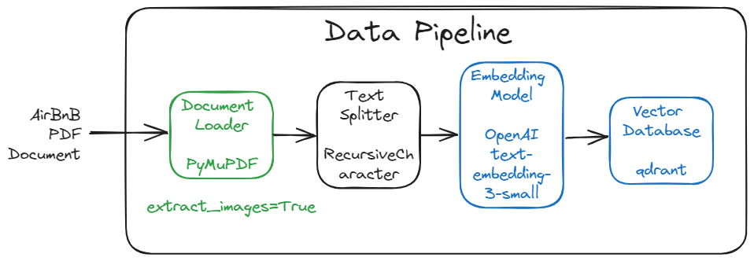
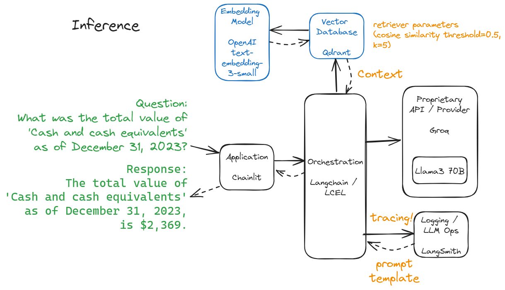

# RAG Application for 10-Q Filing Reviews

## Built using the following specs:
- Data:  [AirBnB Securities Commision pdf](./public/airbnb.pdf) - Form 10-Q filing for Q1 of 2024
- LLM:  Llama3-70B running on Groq
- Embedding model:  OpenAI text-embedding-3-small
- Infrastructure / Framework:  LangChain
- Vector Store: Qdrant
- UI:  Chainlit
- Deployment: Docker on HuggingFace Spaces

## RAG Data Ingestion

- Additional details on the Data Pipeline are in this [Jupyter Notebook](./airbnb_langchain_rag_loader_retriever.ipynb)



## RAG Inference



### Sample Questions

#### Question 1
- Question: What is Airbnb's 'Description of Business'?
- Response: Airbnb's 'Description of Business' is operating a global platform for unique stays and experiences, connecting hosts and guests (collectively referred to as "customers") online or through mobile devices to book spaces and experiences around the world.
- LangSmith trace: https://smith.langchain.com/public/97ddd0f2-9316-40d2-90b2-813519c501d5/r
- Ground Truth: Page 8 - Note 1

#### Question 2
- Question: What was the total value of 'Cash and cash equivalents' as of December 31, 2023?
- Response: The total value of 'Cash and cash equivalents' as of December 31, 2023, is $2,369.
- LangSmith trace: https://smith.langchain.com/public/35425a02-84d7-4bb8-b715-64f96270ac57/r
- Ground Truth: Page 11 - Note 5

#### Question 3
- Question: What is the 'maximum number of shares to be sold under the 10b5-1 Trading plan' by Brian Chesky?
- Response: The maximum number of shares to be sold under the 10b5-1 Trading Plan by Brian Chesky is 1,146,000.
- LangSmith trace: https://smith.langchain.com/public/7854d66c-1317-488c-a0a0-4e492491143f/r
- Ground Truth:  Page 30 - Item 5

### Ground Truth

[Air BnB Form 10-Q Report]


### INITIAL PROMPT - used for answers above

```
<|begin_of_text|><|start_header_id|>system<|end_header_id|>You are an expert financial advisor and subject matter expert in securities commission filings, specializing in analyzing and answering questions about Form 10-Q quarterly reports. Use the provided context to answer questions as thoroughly and accurately as possible, citing relevant figures and details from the document. If multiple excerpts contain similar or related information (e.g. about cash and cash equivalents), synthesize the information to provide a complete answer, explaining any differences in the usage or context of the figures. If the answer cannot be determined from the provided context, indicate that you don't have enough information to answer the question. Keep responses concise, using no more than three sentences per answer.<|eot_id|><|start_header_id|>user<|end_header_id|> 
Question: {question} 
Context: {context} 
Answer: <|eot_id|><|start_header_id|>assistant<|end_header_id|>

```

### CURRENT PROMPT

```
HUMAN

<|begin_of_text|><|start_header_id|>system<|end_header_id|>You are an expert financial advisor and subject matter expert in securities commission filings, specializing in analyzing and answering questions about Form 10-Q quarterly reports. Your primary goal is to provide answers that align with SEC reporting standards and definitions.

<|eot_id|><|start_header_id|>user<|end_header_id|> 

Question: {question}

When analyzing financial data:

1. Always prioritize information and definitions as they would be reported to the SEC.

2. Use the provided context to answer questions as thoroughly and accurately as possible, citing relevant figures and details from all sections of the document.

3. Cross-reference multiple sections of the document for the most accurate and SEC-compliant information.

4. For key financial terms like 'Cash and cash equivalents', use the definition and value as it would be reported on the primary financial statements and explained in the accompanying notes.

5. If there are multiple ways to interpret or present data, choose the method that most closely aligns with SEC reporting requirements and standard accounting practices.

6. Cite specific sections or notes of the 10-Q report used in your analysis.

Provide your response in the following structured format:

[BEGIN_SUMMARY] - Summarize relevant information, prioritizing SEC-compliant data.
[BEGIN_BREAKDOWN] - Provide a detailed analysis of the components, explaining how they align with SEC reporting standards.
[BEGIN_FINAL_ANSWER] - Offer the conclusive response, ensuring it matches what would be reported to the SEC.

Explain your reasoning step-by-step, detailing how you derived the answer from the provided context, with a focus on SEC compliance. Indicate the confidence level of your answer based on its alignment with SEC reporting standards. Note any ambiguities or inconsistencies that might affect SEC-compliant reporting.

Context: {context} 

Answer: <|eot_id|><|start_header_id|>assistant<|end_header_id|>
```
